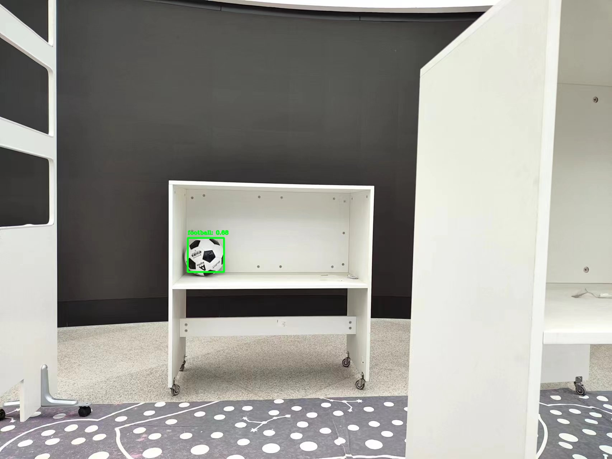

# ubd-ssd

THU UAV Ball Detector based on SSD

清华大学无人机比赛，足球篮球排球检测


## Intro

在 [SSD](https://github.com/amdegroot/ssd.pytorch) 的基础上修改+重新训练而来，考虑到课程组提供的 YOLO 模型效果较差，将此仓库开源，以便选手能够更加专注于无人机和无人车的路径规划和决策控制，不让检测成为制约成绩的瓶颈。

由于 SSD 是在 PyTorch0.4.0 的框架下完成的，本次比赛使用的是 PyTorch1.3.0，所以对原有代码进行了一些修改，目前没有错误出现，如果出现了新的问题，欢迎在本仓库提 issue 或者直接联系邮箱: chengky18@126.com

## Envs

```
torch==1.3.0
numpy
opencv-python
```

用 pip 和 conda 都可

## Usage

下载好权重文件，放在`./weights_ours/`下（如果没有这个文件夹就自己手动创建一下）

在运行无人机程序(tello-control)之前，到这个目录下运行

```
python run_detector.py
```

会自动从`../temp.jpg`读取图像，并将结果（一个字符，足篮排的首字母(f,b,v)）写入`../temp.txt`，如果没检测到就写入`e`

~~不过这里好像还有点小 bug，一会修一下(已修复)~~

## Result

足球(图源见水印)


篮球


排球


## Bugs

- [x] ~~检测为空的处理~~
- [x] ~~torch>=1.3.0 对于 static forward method 的修改，现在会有很多 warning~~
